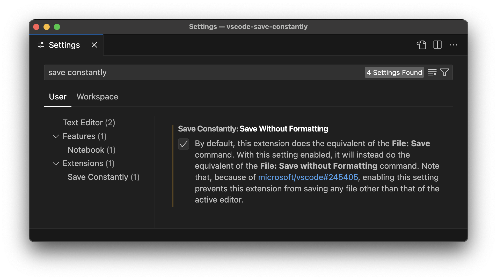

<h1 align="center">Save Constantly </h1>

This is a [VS Code](https://code.visualstudio.com/) extension that lets you toggle documents to save on every change.

## Usage

After installing, execute the command **Save Constantly: Toggle** (bound to **`alt+s`** by default) to enable for the document associated with the active editor. Repeat to disable.

By default, this extension does the equivalent of the **File: Save** command, which can be a bad experience if you have any of the following settings enabled:

- **Editor: Format On Save**
- **Files: Insert Final Newline**
- **Files: Trim Final Newlines**
- **Files: Trim Trailing Whitespace**

To instead do the equivalent of the **File: Save without Formatting** command, enable the **Save Constantly: Save Without Formatting** setting.

## Issues

Because of [microsoft/vscode#245405](https://github.com/microsoft/vscode/issues/245405), enabling the **Save Without Formatting** setting prevents this extension from saving any file other than that of the active editor.

## Related

Michel Betancourt's [Save Typing](https://marketplace.visualstudio.com/items?itemName=akhail.save-typing) extension is similar, but has a couple drawbacks:

- It's configured per language, making it inconvenient to toggle.
- It has no option to save without formatting.
- It's not open source.

## License

This project is licensed under the [MIT License](LICENSE).
